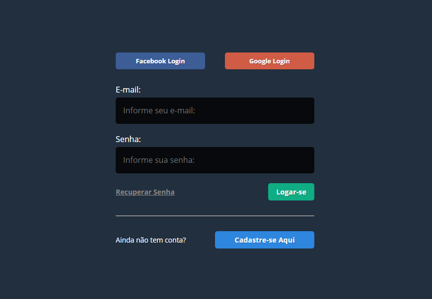
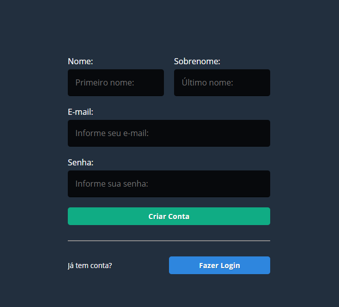
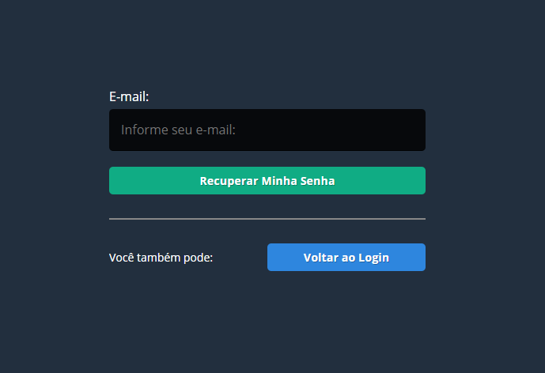

# login-php-puro

Este projeto consiste em um sistema de login completo em PHP puro usando arquitetura MVC de alto nível, com possibilidade de login via contas do facebook ou google, além de autenticação de usuario e recuperação de senha por email.

Tela Inicial Login  

Tela Cadastro  

Tela Esqueci a senha  

Tela Dashboard após login com rede social  

